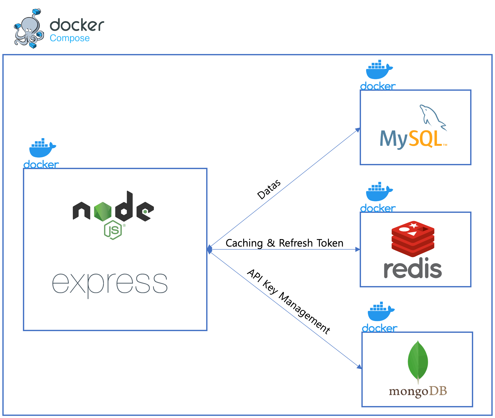

## HUniv API
***
Hongik Univ. API for student to make able to build 3rd party application related to school
***
## Development Tools
- IDE
    - Jetbrain Webstorm
    - Visual Studio Code
- API Testing
    - Insomnia
- OpenAPI Documentation
    - Swagger
- Database
    - RDBMS : MySQL(Convert to PostgreSQL in future version)
    - NoSQL
        - MongoDB
        - Redis
- Database Tools
    - TablePlus
    - MongoDB Compass
- Deployment
    - Docker 
    - Docker Compose
    - Jenkins
    - Nginx
- Test
    - Jest
- Validator
    - Joi
- Code Linter Style Guide
    - [ESLint, Airbnb-Base](https://github.com/airbnb/javascript)
***
## Project Skills
- Language : Node.js 
- Framework : Express.js
- ORM : Sequelize(RDBMS), Mongoose(MongoDB)
- RDBMS Version : MySQL 8.0
- Authorization : JWT Token
***
## Using API in PC
- **Before using API(Important)**
    Set Gmail SMTP with secondary security authentication. And set value in `mail-config.json`. Need `E-mail address` and `secondary security authentication password`

    ```json
    // mail-config.json
    {
        "username": "Gmail email",
        "password": "secondary security authentication password(app password)"
    }
    ```

- Basic Specs
    - Docker installed in PC
    - Linux or Mac OS
- If you're **developing API of this project**
    - Build environment
        ~~~bash
        # If npm installed
        npm run dev

        # If npm not installed
        cd dev-docker && docker-compose up -d && clear && docker exec -it dev-docker-api-1 bash
        ~~~
    - Stop environment  
        ~~~bash
        npm run dev:down

        cd dev-docker && docker compose down && docker rmi hongikapi-dev-container
        ~~~
    - Connect to api container's bash
        ~~~
        npm run dev:bash

        docker exec -it dev-docker-api-1 bash
        ~~~
    - Connect to swagger
        ~~~
        localhost:5500
        ~~~
- If you're **testing API of this project**
    - Build environment
        ~~~bash
        # If npm installed
        npm run service

        # If npm not installed
        docker compose up -d && clear && docker exec -it huniv-api-api-1 bash
        ~~~
    - Stop environment
        ~~~bash
        npm service:down

        docker compose down && docker rmi hongikapi
        ~~~
    - Connect to api container's bash
        ~~~bash
        npm run service:bash

        docker exec -it huniv-api-api-1 bash
        ~~~
    - Connect to swagger
        ~~~
        localhost:6500
        ~~~
- Starting Jest Mocking test
    ~~~bash
    npm run test
    ~~~
## API using rate limits

- Common APIs : 60 requests / 1 min
- Service APIs : 70 requests(user) | 300 requests(admin) / 1min 

## Caching

- Look Asid Pattern + Write Around Pattern
- Why caching pattern applied to this project?
    - Some api endpoints work on a web-scrape basis. Since the crawling scheduler has not yet been applied to this project, there may be a slowdown due to network overhead. To prevent this problem and make service speed more optimize caching was applied.


## Architecture

## Endpoints

- /api


- /api/v1/notice


- /api/v1/auth


- /api/v1/weather


- /api/v1/user


- /api/v1/api-token


## API Document

- Process of using API(In swagger)
    1. Join service with endpoint `api/v1/auth/login`
    2. Login and get Auth-Token with endpoint `api/v1/auth/login`
    3. Make authorization with click `Lock` icon
    4. Issue new API token with endpoint `api/v1/api-token/issue`. Default **API Key expiration term is 90days**
    5. If you want to refresh your token use endpoint `api/v1/api-token/refresh`
    6. If you forgot your API key and want to inquire api token again use endpoint `api/v1/api-token/check-token`
- **Using API token is APIs(important)**
    - Add `hkey` field in header and make request